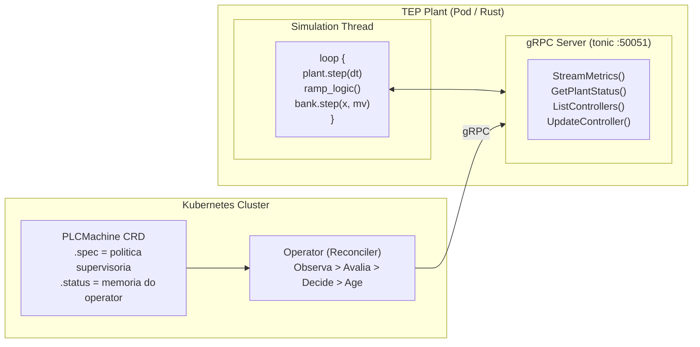

# Arquitetura gRPC — Interface de Observacao e Ajuste

Este documento descreve a API gRPC que a planta TEP expoe para o operator K8s.

---

## Contexto

A planta roda continuamente como um processo Rust com loop deterministico. Disturbios (IDVs) entram aleatoriamente durante a operacao. O Kubernetes (operator) precisa:

1. **Observar** — ler variaveis medidas (XMEAS), manipuladas (XMV) e alarmes
2. **Ajustar** — alterar parametros dos controladores existentes (ganhos, setpoints)

O operator NAO cria/remove controladores e NAO controla disturbios. Controladores sao definidos no codigo Rust (main.rs). Disturbios sao aleatorios — o operator reage aos efeitos.



---

## Comunicacao intra-processo

A simulacao roda em uma thread dedicada. O servidor gRPC roda em tarefas tokio separadas. A ponte e um `Arc<Mutex<SharedState>>`:

```rust
pub struct SharedState {
    pub bank: ControllerBank,        // controladores ativos
    pub metrics: MetricsSnapshot,    // ultimo snapshot de metricas
    pub active_idv: Vec<usize>,      // disturbios ativos (somente leitura)
}
```

O lock e adquirido uma vez por tick na thread de simulacao — executa `bank.step()` e escreve o snapshot de metricas.

---

## API gRPC (4 RPCs)

| RPC                | Tipo     | Descricao |
|--------------------|----------|-----------|
| `StreamMetrics`    | Leitura  | Stream continuo de XMEAS, XMV, alarmes, ISD |
| `GetPlantStatus`   | Leitura  | Snapshot pontual do estado da planta |
| `ListControllers`  | Leitura  | Lista controllers existentes e seus parametros |
| `UpdateController` | Escrita  | Ajusta parametros de um controller existente |

### RPCs removidos

| RPC                | Motivo da remocao |
|--------------------|-------------------|
| `AddController`    | O operator nao cria controllers. Eles sao definidos no codigo Rust |
| `RemoveController` | O operator nao remove controllers |
| `SetDisturbance`   | Disturbios sao aleatorios. O operator reage aos efeitos, nao causa |

---

## Proto resumido

```protobuf
service PlantService {
  rpc StreamMetrics(StreamMetricsRequest) returns (stream PlantMetrics);
  rpc GetPlantStatus(GetPlantStatusRequest) returns (PlantStatus);
  rpc ListControllers(ListControllersRequest) returns (ListControllersResponse);
  rpc UpdateController(UpdateControllerRequest) returns (UpdateControllerResponse);
}
```

Proto completo em `service/proto/tep/v1/plant.proto`.

---

## Fluxo de reconciliacao

Exemplo: IDV(1) entra aleatoriamente e a pressao do reator comeca a subir.

```
t=0h    Planta em regime nominal. Pressure = 2700 kPa.
        Operator monitora via GetPlantStatus: todas variaveis em faixa.

t=3.2h  IDV(1) ativado (aleatorio). Pressao comeca a subir.
        GetPlantStatus reporta: pressure = 2740 (dentro da faixa 2600-2800).
        Operator detecta trend Rising. Phase = Transient, polling acelerado.

t=3.4h  Pressao = 2810. Saiu da faixa.
        Phase = Alarm. ResponseRule "pressure_high" dispara.
        Operator chama: UpdateController("pressure_reactor", kp=0.15).

t=3.5h  Planta aplica kp=0.15 no proximo tick.
        Purge valve responde mais forte. Pressao volta a cair.

t=4.0h  Pressao = 2750. Dentro da faixa. Trend = Falling.
        Phase = Transient (ainda em movimento).

t=5.0h  Pressao estabilizada em ~2710. Trend = Stable.
        Phase = Stable. Polling volta ao intervalo base.
```

---

## Seguranca

- O gRPC NAO controla `dt`, `plant.step()`, nem o integrador
- UpdateController valida que o controller ID existe antes de aplicar
- Campos optional no UpdateControllerRequest — nil = nao altera
- Sem AddController/RemoveController/SetDisturbance = superficie de ataque reduzida
