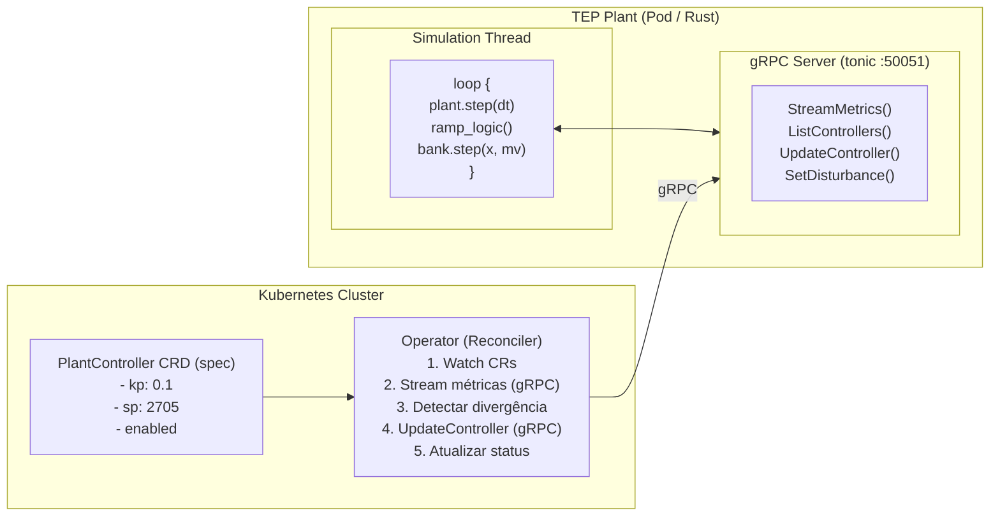

# Arquitetura gRPC — Interface de Controle Supervisório

Este documento descreve a API gRPC que permite ao Kubernetes observar e reconciliar a planta TEP em tempo real.

---

## Contexto

A planta roda continuamente como um processo Rust com loop determinístico. Distúrbios (IDVs) entram aleatoriamente durante a operação. O Kubernetes precisa:

1. **Observar** — ler métricas da planta (XMEAS, XMV, alarmes)
2. **Reconciliar** — alterar parâmetros dos controladores (ganhos, setpoints, ativação)

O padrão é idêntico ao reconciliation loop do Kubernetes: o operator detecta que o estado atual (status) divergiu do estado desejado (spec) e atua para fechar o gap.



---

## Comunicação intra-processo

A simulação roda em uma thread dedicada. O servidor gRPC roda em tarefas `tokio` separadas. A ponte entre eles é um `Arc<Mutex<SharedState>>`:

```rust
pub struct SharedState {
    pub bank: ControllerBank,          // controladores ativos
    pub xmeas: [f64; 22],              // último snapshot de medições
    pub xmv: [f64; 12],               // último snapshot de manipuladas
    pub alarms: Vec<Alarm>,            // alarmes ativos
    pub t_simulation: f64,             // tempo simulado (h)
    pub active_idv: Vec<usize>,        // distúrbios ativos
}
```

O lock é adquirido **uma vez por tick** na thread de simulação — copia `xmeas`/`xmv` para o shared state e lê comandos pendentes. O custo do mutex é desprezível comparado ao custo de um `plant.step(dt)`.

---

## Definição do serviço (.proto)

```protobuf
syntax = "proto3";
package tep.v1;

// ─── Serviço principal ─────────────────────────────────────────────────────────

service PlantService {
  // Observação: stream contínuo de métricas da planta
  rpc StreamMetrics(StreamMetricsRequest) returns (stream PlantMetrics);

  // Leitura: snapshot pontual do estado da planta
  rpc GetPlantStatus(GetPlantStatusRequest) returns (PlantStatus);

  // Leitura: lista controladores ativos e seus parâmetros
  rpc ListControllers(ListControllersRequest) returns (ListControllersResponse);

  // Escrita: atualiza parâmetros de um controlador existente
  rpc UpdateController(UpdateControllerRequest) returns (UpdateControllerResponse);

  // Escrita: adiciona um novo controlador ao banco
  rpc AddController(AddControllerRequest) returns (AddControllerResponse);

  // Escrita: remove um controlador do banco
  rpc RemoveController(RemoveControllerRequest) returns (RemoveControllerResponse);

  // Escrita: ativa/desativa distúrbios IDV
  rpc SetDisturbance(SetDisturbanceRequest) returns (SetDisturbanceResponse);
}

// ─── Métricas e status ─────────────────────────────────────────────────────────

message StreamMetricsRequest {
  double interval_ms = 1;  // intervalo mínimo entre mensagens (0 = cada tick)
}

message PlantMetrics {
  double t_h = 1;                  // tempo simulado (h)
  repeated double xmeas = 2;       // 22 medições contínuas
  repeated double xmv = 3;         // 12 variáveis manipuladas
  repeated Alarm alarms = 4;       // alarmes ativos
  double deriv_norm = 5;           // norma das derivadas (saúde numérica)
  bool isd_active = 6;             // true se a planta entrou em shutdown
}

message Alarm {
  string variable = 1;             // ex: "reactor_pressure"
  string condition = 2;            // ex: "> 3000 kPa"
  bool active = 3;
}

message GetPlantStatusRequest {}

message PlantStatus {
  PlantMetrics metrics = 1;
  repeated ControllerInfo controllers = 2;
  repeated uint32 active_idv = 3;
}

// ─── Controladores ─────────────────────────────────────────────────────────────

message ControllerInfo {
  string id = 1;                   // identificador único (ex: "pressure_reactor")
  string controller_type = 2;      // "P", "PI", "PID"
  uint32 xmeas_index = 3;         // índice da medição (0-based)
  uint32 xmv_index = 4;           // índice da manipulada (0-based)
  double kp = 5;
  double ki = 6;
  double kd = 7;
  double setpoint = 8;
  double bias = 9;
  bool enabled = 10;
  // Status (preenchido pelo servidor)
  double current_measurement = 11; // último valor de xmeas[xmeas_index]
  double current_output = 12;      // último valor de xmv[xmv_index]
  double error = 13;               // measurement - setpoint
}

message ListControllersRequest {}

message ListControllersResponse {
  repeated ControllerInfo controllers = 1;
}

message UpdateControllerRequest {
  string id = 1;                   // qual controlador atualizar
  optional double kp = 2;
  optional double ki = 3;
  optional double kd = 4;
  optional double setpoint = 5;
  optional double bias = 6;
  optional bool enabled = 7;
}

message UpdateControllerResponse {
  bool success = 1;
  string message = 2;
  ControllerInfo controller = 3;   // estado após atualização
}

message AddControllerRequest {
  string id = 1;
  string controller_type = 2;      // "P", "PI", "PID"
  uint32 xmeas_index = 3;
  uint32 xmv_index = 4;
  double kp = 5;
  double ki = 6;
  double kd = 7;
  double setpoint = 8;
  double bias = 9;
}

message AddControllerResponse {
  bool success = 1;
  string message = 2;
  ControllerInfo controller = 3;
}

message RemoveControllerRequest {
  string id = 1;
}

message RemoveControllerResponse {
  bool success = 1;
  string message = 2;
}

// ─── Distúrbios ────────────────────────────────────────────────────────────────

message SetDisturbanceRequest {
  uint32 idv_number = 1;           // 1–20
  bool active = 2;                 // true = ativar, false = desativar
}

message SetDisturbanceResponse {
  bool success = 1;
  string message = 2;
  repeated uint32 active_idv = 3;  // lista atualizada de IDVs ativos
}
```

---

## Mapeamento para o código Rust atual

### O que muda no `ControllerBank`

Para suportar a API, o `ControllerBank` precisa de:

1. **Identificador por controlador** — hoje são anônimos no `Vec`. Cada controlador precisa de um `id: String`.
2. **Leitura de parâmetros** — a trait `Controller` não expõe getters. Precisamos de `fn info(&self) -> ControllerInfo` ou similar.
3. **Escrita de parâmetros** — precisamos de `fn update(&mut self, params: UpdateParams)` na trait.
4. **Enabled/disabled** — flag para desativar uma malha sem removê-la do banco.

### O que muda no `runtime.rs`

```rust
// Antes (atual)
pub fn run(config: Config, mut bank: ControllerBank) {
    // ... loop síncrono bloqueante
}

// Depois
pub fn run(config: Config, shared: Arc<Mutex<SharedState>>) {
    // ... loop síncrono que a cada tick:
    //   1. plant.step(dt)
    //   2. ramp_logic()
    //   3. lock shared → lê bank, aplica bank.step(), escreve métricas → unlock
}
```

### O que muda no `main.rs`

```rust
#[tokio::main]
async fn main() {
    let shared = Arc::new(Mutex::new(SharedState::new(bank, config)));

    // Thread de simulação
    let sim_shared = shared.clone();
    std::thread::spawn(move || {
        runtime::run(config, sim_shared);
    });

    // Servidor gRPC
    let addr = "[::]:50051".parse().unwrap();
    let svc = PlantServiceImpl::new(shared.clone());
    Server::builder()
        .add_service(PlantServiceServer::new(svc))
        .serve(addr)
        .await
        .unwrap();
}
```

---

## Crates necessárias

| Crate         | Propósito                                         |
| ------------- | ------------------------------------------------- |
| `tonic`       | Framework gRPC para Rust (server + client)        |
| `prost`       | Gerador de código Rust a partir de `.proto`       |
| `tokio`       | Runtime assíncrono (já necessário para tonic)     |
| `tonic-build` | Build script para compilar `.proto` em `build.rs` |

Adicionar ao `Cargo.toml`:

```toml
[dependencies]
tonic = "0.12"
prost = "0.13"
tokio = { version = "1", features = ["full"] }

[build-dependencies]
tonic-build = "0.12"
```

---

## Fluxo de reconciliação do Kubernetes

Exemplo concreto: IDV(1) entra aleatoriamente e a pressão do reator começa a subir.

```
t=0h    Planta em regime nominal. Pressure = 2700 kPa.
        Operator observa via StreamMetrics: error ≈ 0.

t=3.2h  IDV(1) ativado. Pressão começa a subir.
        StreamMetrics reporta: pressure = 2740, error = +35 kPa.

t=3.3h  Operator detecta divergência: |error| > threshold (30 kPa).
        Operator atualiza CRD: spec.kp = 0.1 → 1.0.
        Reconciler chama gRPC: UpdateController("pressure_reactor", kp=1.0).

t=3.3h  Planta aplica Kp=1.0 no próximo tick.
        Purge valve responde mais agressivamente.
        Pressão estabiliza abaixo de 3000 kPa.

t=3.5h  StreamMetrics reporta: pressure = 2770, estável.
        Operator atualiza CR status: phase = "Reconciled".
```

---

## Segurança e limites

- **Validação de comandos**: o servidor gRPC valida ranges (kp >= 0, xmeas_idx < 22, xmv_idx < 12) antes de aplicar.
- **Rate limiting**: `UpdateController` ignora chamadas durante o mesmo tick para evitar thrashing.
- **Read-only mode**: flag no `SharedState` para desabilitar escritas (útil para observação passiva).
- **Sem controle do loop de integração**: o gRPC não controla `dt`, `plant.step()`, nem o integrador. Kubernetes altera apenas a camada de controle — nunca o modelo físico.

---

## Próximos passos

1. Criar o arquivo `proto/tep/v1/plant.proto` com a definição acima
2. Adicionar `build.rs` para compilar o proto
3. Implementar `SharedState` com `Arc<Mutex<>>`
4. Refatorar `runtime.rs` para usar `SharedState`
5. Implementar `PlantServiceImpl` (handlers gRPC)
6. Validar que o loop de simulação continua determinístico com o overhead do mutex
7. Containerizar (Dockerfile) e testar com `grpcurl`
